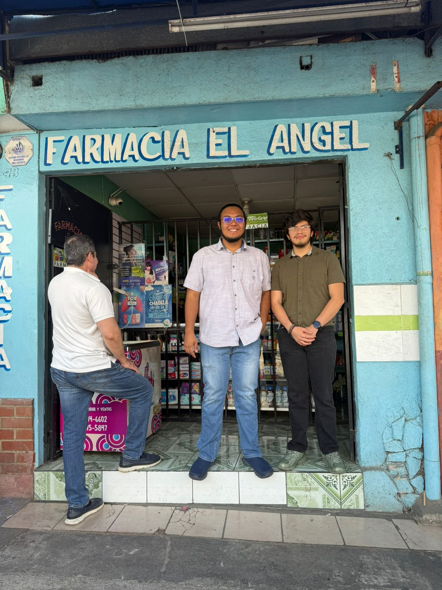
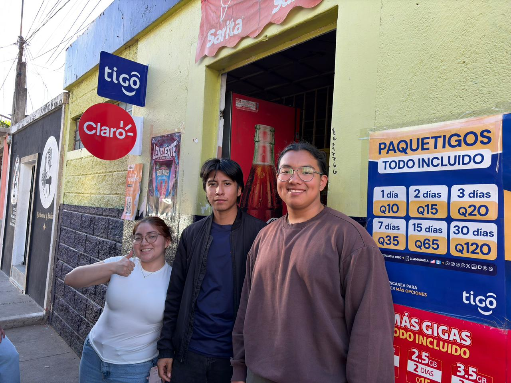

# Evidencias de Entrevistas

## Entrevista 1: Farmacia del Ángel

### Datos generales
- **Fecha:** 10 de abril de 2026  
- **Lugar:** Farmacia del Ángel  
- **Participantes:** Daniel Cabrera, Giovanni Villegas  

### Evidencia fotográfica

**Descripción:**  
Fotografía tomada en el exterior de la Farmacia del Ángel como evidencia de la visita realizada por el equipo. En esta imagen se verifica la presencia del grupo en el lugar donde se llevó a cabo la entrevista.

### Evidencia de audio
- **Audio:** 

**Descripción:**  
Audio de la entrevista realizada al encargado del negocio, donde se recopila información sobre la operación diaria, problemas principales y necesidades del sistema. En esta evidencia se identifican aspectos clave como el uso de registros manuales, dificultades en la dosificación de medicamentos y la falta de herramientas tecnológicas.

### Justificación de la evidencia
La evidencia presentada valida la interacción directa con un negocio real, permitiendo obtener información de primera mano. Esta entrevista fue fundamental para identificar los problemas críticos del negocio, los cuales sirvieron como base para el análisis y la posterior propuesta de solución tecnológica.

---

## Entrevista 2: Abarrotería Gandhi

### Datos generales
- **Fecha:** 10 de abril de 2026  
- **Lugar:** Abarrotería Gani  
- **Participantes:** Ashley Solval, Ángel Saloj, Ángel Juárez  

### Evidencia fotográfica

**Descripción:**  
Fotografía tomada en el exterior de la Abarrotería Gani como evidencia de la visita realizada por el equipo. Esta imagen confirma la presencia en el establecimiento donde se llevó a cabo la entrevista.

### Evidencia de audio
- **Audio:** 

**Descripción:**  
Audio de la entrevista realizada a la encargada del negocio, donde se describen procesos como la colocación de productos, manejo de inventario, control manual de registros y problemas relacionados con proveedores y organización del negocio.

### Justificación de la evidencia
La entrevista permitió comprender el funcionamiento de un negocio similar en cuanto a operaciones manuales y control de inventario. Esta información fue útil para identificar patrones comunes entre distintos tipos de negocios pequeños y reforzar el análisis del problema.

---

## Observación general

Ambas entrevistas fueron realizadas el mismo día, permitiendo obtener información comparativa entre dos negocios distintos: una farmacia y una abarrotería.

A partir del análisis de la información recolectada, en equipo elegimos enfocar la solución principalmente en la **Farmacia del Ángel**, debido a la mayor complejidad de sus procesos y la relevancia de los problemas identificados.

La simulación de la junta directiva técnica se basó en los datos obtenidos de esta entrevista, asegurando coherencia entre la fase de recolección de información y el desarrollo de la propuesta de solución.
